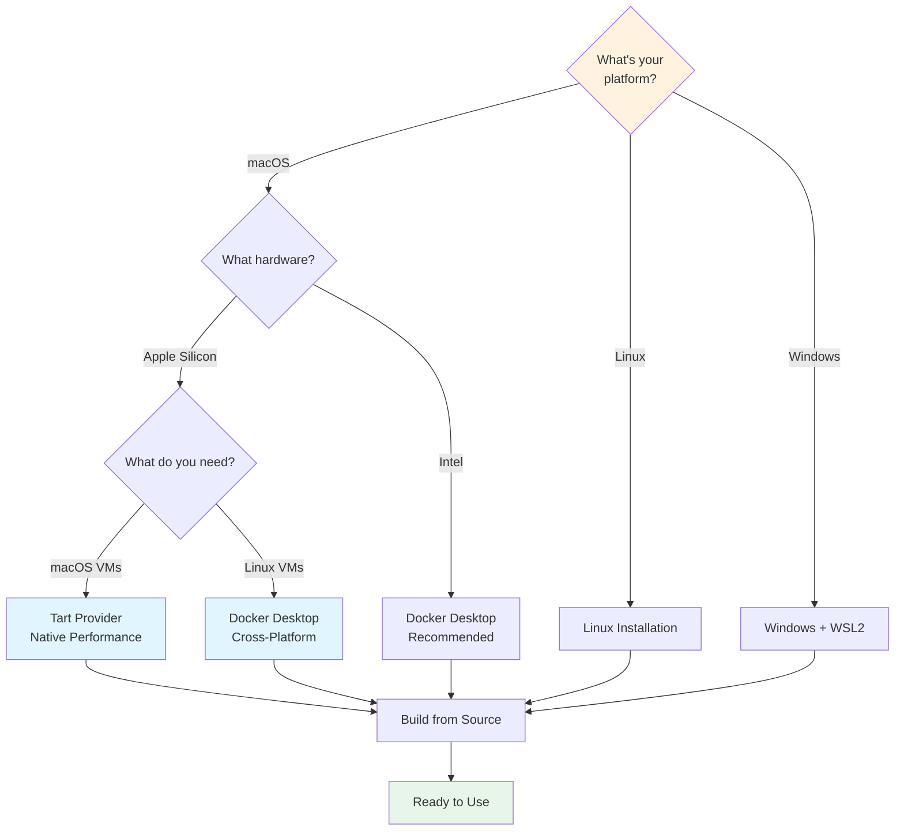

# Installation Guide

Install `vm`, choose a provider, and build the base you need.

## Choose Your Installation Path



:::tip Apple Silicon Users
Use Tart when you want a native macOS VM. Use Docker for the default Linux container path.
:::

:::info Windows Users
WSL2 + Docker Desktop provides the best experience. Install WSL2 first, then follow the Linux installation steps inside your WSL environment.
:::

## Installation

Build from source. That is the supported path.

### Build from Source (Recommended)

```bash
# 1. Clone the repository
git clone https://github.com/goobits/vm.git
cd vm

# 2. Run the installer
./install.sh

# 3. Follow the PATH instructions from the installer

# 4. Start using the tool
vm --version
```

## Prerequisites

### For Building from Source
- **Rust Toolchain**: Required to compile the project. Get it from [rustup.rs](https://rustup.rs/).
- **C Compiler**: The Rust compiler needs a C linker (like `gcc` or `clang`). This is usually pre-installed on macOS and Linux. If not, install your platform's build tools (e.g., `build-essential` on Ubuntu, or Xcode Command Line Tools on macOS).

### For Docker Provider (Default)
- **Docker Desktop** (macOS/Windows) or **Docker Engine** (Linux)
- **docker-compose**

### For Tart Provider (Apple Silicon Macs)
- **macOS** on Apple Silicon (M1/M2/M3/M4)
- **Tart** virtualization tool (`brew install cirruslabs/cli/tart`)
- **SSH client** (included in macOS)

## macOS Installation

### Docker Provider
```bash
# Install Docker Desktop
brew install --cask docker

```

### Tart Provider (Apple Silicon Only)
```bash
# Install Tart
brew install cirruslabs/cli/tart

# Verify installation
tart --version

# Build the standard macOS Tart base
vm base build vibe --provider tart

# Then in your project
vm config preset vibe-tart
vm start
vm start --provider tart

# Or save Tart as the project default
vm config set provider tart
vm start

# Validate both providers
vm base validate vibe

# Linux-on-Tart is explicit
./scripts/build-vibe-tart-base.sh --guest-os linux --name vibe-tart-linux-base
vm config preset vibe-tart-linux
vm start --provider tart
```

## Ubuntu/Debian Installation

### Docker Provider
```bash
# Install Docker
curl -fsSL https://get.docker.com | sh
sudo usermod -aG docker $USER


# Log out and back in for docker group changes to take effect
```

## Windows Installation

### Docker Provider
1. Download and install [Docker Desktop](https://www.docker.com/products/docker-desktop)

## Verification

After installation, verify everything works:

```bash
# Check Docker (if using Docker provider)
docker --version
docker-compose --version

# Test VM tool
vm --help
vm start  # Should work with defaults
```

## Environment Variables

### VM_TOOL_DIR
Override VM tool directory detection for custom installations:

```bash
# Set custom VM tool directory (useful for development or non-standard installations)
export VM_TOOL_DIR=/path/to/vm/installation
vm start

# Add to shell profile for permanent setting
echo 'export VM_TOOL_DIR=/path/to/vm' >> ~/.bashrc
# Or for zsh users
echo 'export VM_TOOL_DIR=/path/to/vm' >> ~/.zshrc
```

**When to use VM_TOOL_DIR:**
- Development builds from source
- Custom installation locations
- Binary installed via symlink causing path detection issues
- Container environments where `/vm-tool` mount needs explicit path

**Auto-detection**: Usually unnecessary - VM tool automatically detects installation path from binary location.

## Troubleshooting Installation

### Docker Issues
- **macOS/Windows**: Ensure Docker Desktop is running
- **Linux**: Check if docker service is started: `sudo systemctl start docker`
- **Permissions**: Make sure your user is in the docker group: `groups | grep docker`


### General Issues
- **Path problems**: Make sure the vm command is in your PATH after global installation
- **Permission denied**: Check that install.sh is executable: `chmod +x install.sh`

## Shell Completion

The installer attempts to install tab completion automatically for your current shell. For `bash` and `zsh`, it also updates your shell profile to source the generated completion file.

:::tip Test Completion
After setup, verify it works: Type `vm st` and press Tab → it should complete to `vm start`
:::

## Updating

### Self-Update Command (All Installation Methods)
```bash
# Update to latest version
vm update

# Update to specific version
vm update --version v1.2.3

# Force update even if already at latest
vm update --force
```

### Manual Update Methods

#### Binary Installation
```bash
# Re-run the installer to get the latest version
curl -sSL https://raw.githubusercontent.com/goobits/vm/main/install.sh | bash
```

#### Cargo Installation
```bash
cargo install vm --force
```

#### Source Installation
```bash
cd vm
git pull
./install.sh
```

## Uninstallation

### Automated Uninstall (Recommended)
```bash
# Interactive uninstall with confirmation
vm uninstall

# Keep configuration files
vm uninstall --keep-config

# Skip confirmation prompt
vm uninstall -y
```

The `vm uninstall` command will:
- Remove the vm binary
- Clean up configuration files (unless --keep-config is used)
- Remove PATH entries from shell configuration files
- Provide instructions for final cleanup

### Manual Uninstall

#### Binary Installation
```bash
# Remove the binary
rm ~/.cargo/bin/vm

# Or if installed elsewhere
rm $(which vm)
```

#### Cargo Installation
```bash
cargo uninstall vm
```

#### Configuration Cleanup
```bash
# Remove configuration files (optional)
rm -rf ~/.vm
rm -rf ~/.config/vm
rm ~/.vm-install.log

# Remove PATH entries from your shell config
# Edit ~/.bashrc, ~/.zshrc, or relevant shell config
```
