# Quick Start Guide

Get your isolated development environment running in under 5 minutes.

## Your Journey

```mermaid
flowchart LR
    Start([📦 Clone & Build]) --> Create[🚀 vm up]
    Create --> Detect{🔍 Auto-detect<br/>Project Type}
    Detect -->|package.json| Node[⚡ Node.js]
    Detect -->|requirements.txt| Python[🐍 Python]
    Detect -->|Gemfile| Ruby[💎 Ruby]
    Detect -->|No match| Manual[⚙️ Manual Config]
    Node --> Ready[✅ Ready to Code]
    Python --> Ready
    Ruby --> Ready
    Manual --> Ready
    Ready --> SSH[💻 vm ssh]

    style Start fill:#e3f2fd
    style Ready fill:#e8f5e9
    style Detect fill:#fff3e0
    style SSH fill:#f3e5f5
```



:::tip Zero Configuration
VM Tool automatically detects your project type and installs dependencies. No configuration needed for most frameworks!
:::

## Minimal Setup

```bash
# 1. Clone the repository and build from source
git clone https://github.com/goobits/vm.git
cd vm
./install.sh --build-from-source

# 2. Create environment (auto-detects your project)
vm up

# 3. Enter your development environment
vm ssh
```

### What Gets Auto-Detected?

The tool analyzes your project files to identify the framework:

| Project File | Detected Environment | Installed Tools |
|--------------|---------------------|-----------------|
| `package.json` | Node.js (React, Vue, Angular) | Node.js, npm, project dependencies |
| `requirements.txt` / `Pipfile` | Python (Django, Flask) | Python, pip, virtualenv, dependencies |
| `Gemfile` | Ruby (Rails, Sinatra) | Ruby, bundler, gems |
| Framework files | Auto-configured | Framework-specific tools |

:::info Manual Configuration
If detection doesn't match your setup, create a `vm.yaml` file in your project root. See the [Configuration Guide](../user-guide/configuration.md).
:::

## Common Workflows

### Web Development
```bash
# React/Vue/Angular projects
cd my-frontend-app
vm up                    # → Node.js, npm, dev server ready
vm ssh
npm run dev                  # Runs on auto-configured ports
```

### API Development
```bash
# Django/Flask/Rails projects
cd my-api-project
vm up                    # → Python/Ruby + PostgreSQL + Redis
vm ssh
python manage.py runserver   # Database already configured
```

### Quick Experiments
```bash
# Test code in isolated environment
vm temp create ./src ./tests # Mount specific folders
vm temp ssh                  # Jump in and experiment
vm temp destroy              # Clean up when done
```

## Basic Customization

Only customize if the auto-detection doesn't work for you:

```yaml
# vm.yaml - minimal override
os: ubuntu
provider: docker
project:
  name: my-project
ports:
  frontend: 3000
  backend: 8000
```

## Essential Commands

```bash
# Daily workflow
vm up          # Create/configure/start and SSH
vm ssh         # Enter the VM
vm down        # Stop VM (keeps data)
vm up          # Resume stopped VM
vm destroy     # Delete completely

# Quick info
vm status      # List all VMs (or `vm status <vm>` for detail)
vm logs          # View service logs
```

## Temporary VMs

Suitable for testing, code reviews, or experiments:

```bash
vm temp create ./feature-branch  # Mount specific directories
vm temp ssh                      # Enter temp environment
vm temp destroy                  # Clean up when done
```

## Need Help?

:::danger Quick Fix
90% of issues are solved by resetting your environment:
```bash
vm destroy && vm up
```
:::

:::tip Getting Unstuck
- **Not working?** Try `vm destroy && vm up` to reset
- **Missing features?** Check the [Presets Guide](../user-guide/presets.md) for available configurations
- **Custom setup?** See the [Configuration Guide](../user-guide/configuration.md)
- **All commands?** View the [CLI Reference](../user-guide/cli-reference.md)
:::

:::info Data Safety
Database backups are created automatically on `vm destroy`. Your data is safe when resetting!
:::

## Next Steps

- [Configuration Guide](../user-guide/configuration.md) - Customize your environment
- [Presets Guide](../user-guide/presets.md) - Understand auto-detection
- [CLI Reference](../user-guide/cli-reference.md) - Complete command list
