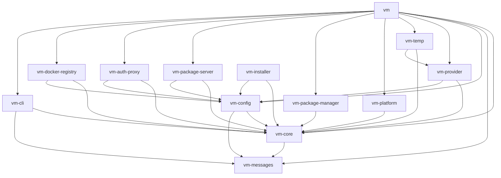

# Goobits VM Architecture

## Overview

Goobits VM is built using a **layered architecture** designed around the principles of separation of concerns, dependency injection, and circular dependency elimination. The architecture promotes modularity, testability, and maintainability by organizing functionality into distinct crates with clear responsibilities and well-defined interfaces.

### Key Architectural Goals

- **Separation of Concerns**: Each crate has a single, well-defined responsibility
- **Dependency Flow Control**: Dependencies flow in one direction, preventing circular dependencies
- **Provider Abstraction**: Multiple VM providers (Docker, Podman, Tart) through a unified interface
- **Error Consistency**: Unified error handling across all components
- **Testability**: Modular design enables comprehensive testing at all levels

## Crate Quick Reference

| Layer | Crate | Primary Responsibility | Quick Checks |
| --- | --- | --- | --- |
| Foundation | `vm-core` | Shared error types, FS utilities, platform helpers | `cargo test -p vm-core` |
| Foundation | `vm-messages` | Localized CLI copy and help text | `cargo test -p vm-messages` |
| Foundation | `vm-logging` | Tracing subscriber + log routing setup used by every binary | `cargo test -p vm-logging` |
| Configuration | `vm-config` | Configuration schema, detectors, CLI helpers | `cargo test -p vm-config` |
| Configuration | `vm-plugin` | Plugin discovery, validation, and preset/service loading | `cargo test -p vm-plugin` |
| Provider | `vm-provider` | Provider traits plus Docker/Podman/Tart implementations | `cargo test -p vm-provider` |
| Provider | `vm-temp` | Temporary VM lifecycle, mount management, CLI glue | `cargo test -p vm-temp` |
| Application | `vm` | Main CLI orchestration and commands | `cargo test -p vm` / `cargo run -p vm -- --help` |
| Application | `vm-cli` | Message builder and `msg!` macro for formatted output | `cargo test -p vm-cli` |
| Application | `vm-installer` | Self-installation flow for distributing the CLI | `cargo run -p vm-installer -- --help` |
| Service | `vm-package-server` | Local multi-registry artifact service | `cargo test -p vm-package-server` / `cargo run -p vm-package-server -- --help` |
| Service | `vm-auth-proxy` | Authentication proxy that fronts API/services | `cargo run -p vm-auth-proxy -- --help` |
| Service | `vm-docker-registry` | Auto-managed Docker registry cache | `cargo test -p vm-docker-registry` |
| Service | `vm-api` | REST API entrypoint for hosted workspaces | `cargo run -p vm-api -- --help` |
| Service | `vm-orchestrator` | Workspace orchestration logic shared by services | `cargo test -p vm-orchestrator` |
| Utility | `vm-package-manager` | Unified installer for npm/pip/cargo tooling | `cargo run -p vm-package-manager -- --help` |
| Utility | `vm-platform` | OS detection, system integration, resource probing | `cargo test -p vm-platform` |
| Tooling | `version-sync` | Keeps version numbers aligned across manifests | `cargo run -p version-sync -- check` |

## Crate Architecture

### Foundation Layer

#### vm-core
**Role**: The foundational crate providing shared utilities and error handling for the entire workspace.

**Responsibilities**:
- Unified error types (`VmError`) used throughout the system
- Cross-cutting utilities (file system operations, command execution, platform detection)
- Core traits and interfaces shared across crates
- System validation and health checks
- Output formatting macros (`vm_println!`, `vm_error!`, etc.)

**Key Exports**: `VmError`, `Result`, file system utilities, command streaming, platform detection

#### vm-messages
**Role**: Pure data crate containing centralized message templates and user-facing text.

**Responsibilities**:
- Localized message templates for CLI output
- User-facing error messages and help text
- Documentation and instructional content
- Zero dependencies on other workspace crates

**Key Exports**: `MESSAGES` constant with categorized message templates

### Configuration Layer

#### vm-config
**Role**: Configuration management, validation, and project detection capabilities.

**Responsibilities**:
- VM configuration schema definition and validation
- YAML configuration file parsing and generation
- Project type detection (Node.js, Python, Docker, etc.)
- Port management and allocation
- Global settings and user preferences
- CLI argument parsing and command routing

**Key Exports**: `VmConfig`, `AppConfig`, `GlobalConfig`, project detectors, CLI commands

### Provider Layer

#### vm-provider
**Role**: Provider abstraction layer enabling support for multiple VM technologies.

**Responsibilities**:
- `Provider` trait defining the contract for all VM providers
- `TempProvider` trait for temporary VM operations
- Docker, Podman, and Tart provider implementations
- VM lifecycle management (create, start, stop, destroy)
- Enhanced status reporting with real-time metrics
- Service health monitoring and port mapping

**Key Exports**: `Provider` trait, `TempProvider` trait, `get_provider()` factory, provider implementations

#### vm-temp
**Role**: Temporary VM management for ephemeral development environments.

**Responsibilities**:
- Temporary VM lifecycle management
- Dynamic mount point management
- Cleanup and resource management
- Integration with main VM providers

**Key Exports**: Temporary VM operations, mount management utilities

### Application Layer

#### vm
**Role**: Main CLI application binary that orchestrates all other components.

**Responsibilities**:
- CLI command implementation and routing
- User interaction and experience
- Command validation and execution
- Integration of all lower-level components
- Service registration and management

**Key Exports**: Main binary, command handlers, service orchestration

#### vm-cli
**Role**: Message template variable substitution and CLI output formatting.

**Responsibilities**:
- Variable substitution in `vm-messages` templates via the `msg!` macro.
- Building complex, formatted messages with `MessageBuilder`.
- Handling terminal output, colors, and styling.

**Key Exports**: `msg!` macro, `MessageBuilder` struct

### Service Layer

#### vm-package-server
**Role**: Package registry and artifact management service.

**Responsibilities**:
- Local package registry for VM artifacts
- Package upload, download, and management
- Version control and metadata tracking
- HTTP API for package operations

**Key Exports**: Package server implementation, HTTP handlers, registry operations

#### vm-auth-proxy
**Role**: Authentication and authorization proxy for VM services.

**Responsibilities**:
- Authentication proxy for development services
- Session management and token validation
- Security middleware for VM-exposed services
- OAuth and API key management

**Key Exports**: Auth proxy server, middleware, session management

#### vm-docker-registry
**Role**: Local Docker registry service for VM images.

**Responsibilities**:
- Local Docker image registry
- Image storage and retrieval
- Registry API implementation
- Integration with Docker provider

**Key Exports**: Docker registry implementation, image management

### Utility Layer

#### vm-platform
**Role**: Platform-specific utilities and system integration.

**Responsibilities**:
- Operating system detection and capabilities
- Platform-specific file system operations
- System resource monitoring
- Hardware detection and reporting

**Key Exports**: Platform detection, system utilities, resource monitoring

#### vm-package-manager
**Role**: Package manager integration and link detection.

**Responsibilities**:
- Integration with npm, pip, cargo, and other package managers
- Development package link detection
- Package dependency analysis
- Version management utilities

**Key Exports**: Package manager integrations, link detection, dependency analysis

## Dependency Flow

## Error Handling Philosophy

Goobits VM employs a **unified error handling strategy** centered around the `VmError` enum defined in `vm-core`. This approach ensures consistent error reporting and handling across all components.

### Core Principles

1. **Single Error Type**: All errors throughout the system are represented as `VmError` variants
2. **Contextual Information**: Errors include rich context about what operation failed and why
3. **User-Friendly Messages**: Error messages are crafted for end-user consumption
4. **Structured Handling**: Different error types enable appropriate handling strategies

### Error Categories

- **`Config`**: Configuration validation and parsing errors
- **`Provider`**: VM provider-specific operational failures
- **`Io`**: File system and I/O operations (auto-converted from `std::io::Error`)
- **`Command`**: External command execution failures
- **`Dependency`**: Missing system dependencies or tools
- **`Network`**: Network connectivity and remote operation failures
- **`Internal`**: Unexpected internal errors and programming bugs
- **`Filesystem`**: File system operation failures
- **`Serialization`**: YAML/JSON parsing and generation errors

### Error Flow

All errors originate from lower-level crates and flow upward through the dependency chain:

1. **Origin**: Errors occur in foundation or provider layers
2. **Propagation**: Errors bubble up through the call stack as `VmError` variants
3. **Context**: Each layer can add contextual information without changing the error type
4. **Handling**: The application layer (`vm`) provides final error formatting and user feedback

### Implementation Guidelines

- **Use `Result<T>` consistently**: All fallible operations return `Result<T, VmError>`
- **Convert early**: Convert external errors to `VmError` as close to the source as possible
- **Add context**: Use `.map_err()` to add contextual information when propagating errors
- **Fail fast**: Validate inputs early and fail with clear error messages
- **Log appropriately**: Use tracing for debugging while showing user-friendly messages

## Testing Strategy

The layered architecture enables comprehensive testing at multiple levels:

- **Unit Tests**: Each crate includes extensive unit tests for its core functionality
- **Integration Tests**: Cross-crate functionality is tested through integration test suites
- **End-to-End Tests**: Complete workflows are tested through the main CLI interface
- **Mock Providers**: Test providers enable testing without external dependencies

## Future Architecture Considerations

The current architecture provides a solid foundation for future enhancements:

- **Plugin System**: The provider abstraction can be extended to support external plugins
- **API Layer**: A REST API layer could be added above the current application layer
- **Event System**: Event-driven architecture could be introduced for better service coordination
- **Metrics Collection**: Centralized metrics and telemetry could be added to the core layer

This architecture balances simplicity with extensibility, providing a maintainable foundation that can evolve with the project's needs.
