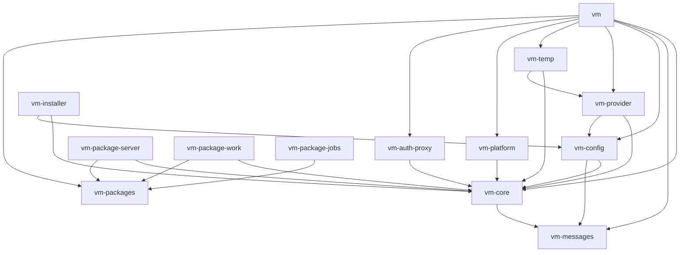

# Goobits VM Architecture

## Overview

Goobits VM is built using a **layered architecture** designed around the principles of separation of concerns, dependency injection, and circular dependency elimination. The architecture promotes modularity, testability, and maintainability by organizing functionality into distinct crates with clear responsibilities and well-defined interfaces.

### Key Architectural Goals

- **Separation of Concerns**: Each crate has a single, well-defined responsibility
- **Dependency Flow Control**: Dependencies flow in one direction, preventing circular dependencies
- **Provider Abstraction**: Multiple VM providers (Docker, Podman, Tart) through a unified interface
- **Error Consistency**: Unified error handling across all components
- **Testability**: Modular design enables comprehensive testing at all levels

## Crate Quick Reference

| Layer | Crate | Primary Responsibility | Quick Checks |
| --- | --- | --- | --- |
| Foundation | `vm-core` | Shared errors, output primitives, FS utilities, platform helpers | `cargo test -p vm-core` |
| Foundation | `vm-messages` | Reusable config, plugin, and service message templates | `cargo test -p vm-messages` |
| Foundation | `vm-logging` | Tracing subscriber + log routing setup used by every binary | `cargo test -p vm-logging` |
| Configuration | `vm-config` | Configuration schema, detectors, CLI helpers | `cargo test -p vm-config` |
| Configuration | `vm-plugin` | Plugin discovery, validation, and preset/service loading | `cargo test -p vm-plugin` |
| Provider | `vm-provider` | Provider traits plus Docker/Podman/Tart implementations | `cargo test -p vm-provider` |
| Provider | `vm-temp` | Temporary VM lifecycle, mount management, CLI glue | `cargo test -p vm-temp` |
| Provider | `vm-snapshot` | Snapshot lifecycle: create, restore, export, and import | `cargo test -p vm-snapshot` |
| Application | `vm` | Main CLI orchestration and commands | `cargo test -p goobits-vm` / `cargo run -p goobits-vm -- --help` |
| Application | `vm-installer` | Self-installation flow for distributing the CLI | `cargo run -p vm-installer -- --help` |
| Domain | `vm-packages` | Package protocols, workflow records, appliance definition, client | `cargo test -p vm-packages` |
| Service | `vm-package-server` | Immutable npm, Cargo, PyPI, and tool artifacts | `cargo test -p vm-package-server` |
| Service | `vm-package-work` | Deterministic checkout, review, release, and rollout state | `cargo test -p vm-package-work` |
| Service | `vm-package-jobs` | Persistent review, release, and rollout workers | `cargo test -p vm-package-jobs` |
| Service | `vm-auth-proxy` | Authentication proxy that fronts API/services | `cargo run -p vm-auth-proxy -- --help` |
| Utility | `vm-platform` | OS detection, system integration, resource probing | `cargo test -p vm-platform` |
| Tooling | `version-sync` | Keeps version numbers aligned across manifests | `cargo run -p version-sync -- check` |

## Crate Architecture

### Foundation Layer

#### vm-core
**Role**: The foundational crate providing shared utilities and error handling for the entire workspace.

**Responsibilities**:
- Unified error types (`VmError`) used throughout the system
- Cross-cutting utilities (file system operations, command execution, platform detection)
- Core traits and interfaces shared across crates
- System validation and health checks
- Message substitution and shared stdout/stderr primitives (`msg!`, `vm_println!`,
  `vm_progress!`, `vm_error!`, etc.)

**Key Exports**: `VmError`, `Result`, output macros, file system utilities,
command streaming, platform detection

#### vm-messages
**Role**: Pure data crate containing reusable domain message templates.

**Responsibilities**:
- Configuration workflow messages
- Plugin workflow messages
- Service and installer messages
- Zero dependencies on other workspace crates

**Key Exports**: `MESSAGES` constant with categorized message templates

General lifecycle copy stays with its command. Shared output behavior belongs
to `vm-core`; the executable renders each fatal error once.

### Configuration Layer

#### vm-config
**Role**: Configuration management, validation, and project detection capabilities.

**Responsibilities**:
- VM configuration schema definition and validation
- YAML configuration file parsing and generation
- Project type detection (Node.js, Python, Docker, etc.)
- Port management and allocation
- Global settings and user preferences
- Configuration-specific CLI helpers

**Key Exports**: `VmConfig`, `AppConfig`, `GlobalConfig`, project detectors, CLI commands

### Provider Layer

#### vm-provider
**Role**: Provider abstraction layer enabling support for multiple VM technologies.

**Responsibilities**:
- `Provider` trait defining the contract for all VM providers
- `TempProvider` trait for temporary VM operations
- Docker, Podman, and Tart provider implementations
- VM lifecycle management (create, start, stop, destroy)
- Enhanced status reporting with real-time metrics
- Service health monitoring and port mapping

**Key Exports**: `Provider` trait, `TempProvider` trait, `get_provider()` factory, provider implementations

#### vm-temp
**Role**: Temporary VM management for ephemeral development environments.

**Responsibilities**:
- Temporary VM lifecycle management
- Dynamic mount point management
- Cleanup and resource management
- Integration with main VM providers

**Key Exports**: Temporary VM operations, mount management utilities

#### vm-snapshot
**Role**: Snapshot lifecycle management for VM state, used both for project-scoped
checkpoints and for global base-image snapshots.

**Responsibilities**:
- Create, restore, list, and delete snapshots scoped per project or globally
- Export snapshots to a portable `.tar.gz` archive (image layers + volumes + metadata)
- Import snapshots, validating manifest, platform compatibility, and entry paths
  before extraction
- Parallel Docker image save/load for large multi-service snapshots

**Key Exports**: `SnapshotManager`, `SnapshotScope`, `SnapshotMetadata`,
import/export entry points

### Application Layer

#### vm
**Role**: Main CLI application binary that orchestrates all other components.

**Responsibilities**:
- CLI command implementation and routing
- User interaction and experience
- Command validation and execution
- Integration of all lower-level components
- Service registration and management

**Key Exports**: Main binary, command handlers, service orchestration

### Service Layer

#### vm-packages
**Role**: Provider-neutral package-infrastructure contract and client.

**Responsibilities**:
- Shared protocol and workflow records
- Validated package, tool, consumer, and release identities
- Docker Compose appliance definition and guest client environment
- Authenticated controller client

**Key Exports**: `PackageInfrastructureClient`, `RegistryEndpoints`, workflow
records, appliance resources

#### vm-package-server
**Role**: Package registry and artifact management service.

**Responsibilities**:
- Local package registry for VM artifacts
- Package upload, download, and management
- Version control and metadata tracking
- HTTP API for package operations

**Key Exports**: Package server implementation, HTTP handlers, registry operations

#### vm-package-work
**Role**: Deterministic workflow state and isolated Git-source controller.

**Responsibilities**:
- Checkout leases and state transitions
- Isolated package and consumer worktrees
- Submission, integration, release, rollout, and recovery receipts

**Key Exports**: `run`, `WorkCredentials`, workflow error contract. The router,
store, source manager, and persistence records remain service-internal.

#### vm-package-jobs
**Role**: Credential-scoped package workflow workers.

**Responsibilities**:
- Persistent isolated integration review
- Persistent private release publication
- Persistent isolated consumer upgrades
- Ephemeral tool publication

**Key Exports**: Review, release, and rollout binaries

#### vm-auth-proxy
**Role**: Authentication and authorization proxy for VM services.

**Responsibilities**:
- Authentication proxy for development services
- Session management and token validation
- Security middleware for VM-exposed services
- OAuth and API key management

**Key Exports**: Auth proxy server, middleware, session management

### Utility Layer

#### vm-platform
**Role**: Platform-specific utilities and system integration.

**Responsibilities**:
- Operating system detection and capabilities
- Platform-specific file system operations
- System resource monitoring
- Hardware detection and reporting

**Key Exports**: Platform detection, system utilities, resource monitoring

## Dependency Flow

```mermaid
graph TD
    %% Foundation layer
    A[vm-core] --> B[vm-messages]

    %% Configuration layer
    C[vm-config] --> A
    C --> B

    %% Provider layer
    D[vm-provider] --> A
    D --> C
    E[vm-temp] --> A
    E --> D

    %% Utility layer
    F[vm-platform] --> A
    Q[vm-packages]

    %% Service layer
    H[vm-package-server] --> A
    H --> Q
    W[vm-package-work] --> A
    W --> Q
    J[vm-package-jobs] --> Q
    I[vm-auth-proxy] --> A

    %% Application layer
    L[vm] --> A
    L --> B
    L --> C
    L --> D
    L --> E
    L --> F
    L --> I
    L --> Q

    %% Installer
    M[vm-installer] --> A
    M --> C
```

## Error Handling Philosophy

Goobits VM uses the shared `VmError` type from `vm-core` at cross-crate
boundaries. Libraries return errors without printing them. The `vm` executable
adds final context and renders each fatal error once.

### Core Principles

1. **Structured errors**: Preserve the operation and failure category.
2. **Single rendering point**: Do not print a failure before returning it.
3. **Stable streams**: Requested data uses stdout; diagnostics use stderr.
4. **Safe context**: Never include credentials or raw secret-bearing arguments.

The enum in `vm-core/src/error.rs` is the canonical error-category inventory.

### Error Flow

1. **Origin**: A crate captures the local operation and source failure.
2. **Ownership**: Public cross-crate boundaries convert failures to `VmError`.
3. **Propagation**: Higher layers add context without printing the failure.
4. **Handling**: The application layer (`vm`) provides final formatting and feedback.

### Implementation Guidelines

- **Use the owning result type**: Keep local error details inside their crate.
- **Convert at boundaries**: Map external errors to `VmError` before crossing crates.
- **Add context once**: Describe the failed operation without printing it.
- **Fail fast**: Validate inputs early and fail with clear error messages
- **Log safely**: Use tracing for debugging without recording secret-bearing arguments.

## Testing Strategy

The layered architecture enables comprehensive testing at multiple levels:

- **Unit Tests**: Each crate includes extensive unit tests for its core functionality
- **Integration Tests**: Cross-crate functionality is tested through integration test suites
- **End-to-End Tests**: Complete workflows are tested through the main CLI interface
- **Mock Providers**: Test providers enable testing without external dependencies

The root [Testing Guide](../docs/development/testing.md) owns supported commands
and provider-isolation rules.
