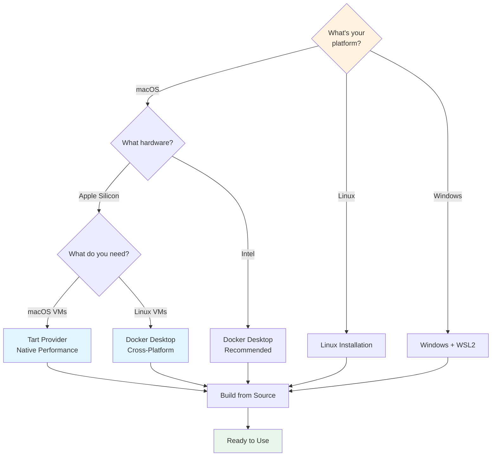

# Installation Guide

Development environment setup.

## Choose Your Installation Path



:::tip Apple Silicon Users
Tart provides native macOS virtualization with better performance than Docker for macOS VMs. Use `os: macos` in your `vm.yaml` to leverage this!
:::

:::info Windows Users
WSL2 + Docker Desktop provides the best experience. Install WSL2 first, then follow the Linux installation steps inside your WSL environment.
:::

## Installation

**Note**: Pre-compiled binaries are not yet available for all platforms. The only official installation method is to build from source.

### Build from Source (Recommended)

This is the most reliable way to install the `vm` tool.

```bash
# 1. Clone the repository
git clone https://github.com/goobits/vm.git
cd vm

# 2. Run the build-from-source installer
./install.sh --build-from-source

# 3. Follow the on-screen instructions to update your shell's PATH
#   (e.g., run `source ~/.bashrc` or restart your terminal)

# 4. Start using the tool
vm --version
```

## Prerequisites

### For Building from Source
- **Rust Toolchain**: Required to compile the project. Get it from [rustup.rs](https://rustup.rs/).
- **C Compiler**: The Rust compiler needs a C linker (like `gcc` or `clang`). This is usually pre-installed on macOS and Linux. If not, install your platform's build tools (e.g., `build-essential` on Ubuntu, or Xcode Command Line Tools on macOS).

### For Docker Provider (Default)
- **Docker Desktop** (macOS/Windows) or **Docker Engine** (Linux)
- **docker-compose**

### For Vagrant Provider
- **VirtualBox** or **Parallels**
- **Vagrant**

### For Tart Provider (Apple Silicon Macs)
- **macOS** on Apple Silicon (M1/M2/M3/M4)
- **Tart** virtualization tool (`brew install cirruslabs/cli/tart`)
- **SSH client** (included in macOS)

## macOS Installation

### Docker Provider
```bash
# Install Docker Desktop
brew install --cask docker

```

### Vagrant Provider  
```bash
# Install Vagrant and VirtualBox
brew tap hashicorp/tap
brew install hashicorp/tap/hashicorp-vagrant
brew install --cask virtualbox
```

### Tart Provider (Apple Silicon Only)
```bash
# Install Tart for native macOS/Linux VMs
brew install cirruslabs/cli/tart

# Verify installation
tart --version

# That's it! Use with:
# echo "os: macos" > vm.yaml && vm create
```

## Ubuntu/Debian Installation

### Docker Provider
```bash
# Install Docker
curl -fsSL https://get.docker.com | sh
sudo usermod -aG docker $USER


# Log out and back in for docker group changes to take effect
```

### Vagrant Provider
```bash
# Add HashiCorp GPG key
wget -O- https://apt.releases.hashicorp.com/gpg | \
  sudo gpg --dearmor -o /usr/share/keyrings/hashicorp-archive-keyring.gpg

# Add HashiCorp repository
echo "deb [signed-by=/usr/share/keyrings/hashicorp-archive-keyring.gpg] \
  https://apt.releases.hashicorp.com $(lsb_release -cs) main" | \
  sudo tee /etc/apt/sources.list.d/hashicorp.list

# Install packages
sudo apt update && sudo apt install vagrant virtualbox
```

## Windows Installation

### Docker Provider
1. Download and install [Docker Desktop](https://www.docker.com/products/docker-desktop)

### Vagrant Provider
1. Download **Vagrant** from [vagrant.com](https://www.vagrantup.com/downloads)
2. Download **VirtualBox** from [virtualbox.org](https://www.virtualbox.org/wiki/Downloads)

## Verification

After installation, verify everything works:

```bash
# Check Docker (if using Docker provider)
docker --version
docker-compose --version

# Check Vagrant (if using Vagrant provider)  
vagrant --version
VBoxManage --version

# Test VM tool
vm --help
vm create  # Should work with defaults
```

## Environment Variables

### VM_TOOL_DIR
Override VM tool directory detection for custom installations:

```bash
# Set custom VM tool directory (useful for development or non-standard installations)
export VM_TOOL_DIR=/path/to/vm/installation
vm create

# Add to shell profile for permanent setting
echo 'export VM_TOOL_DIR=/path/to/vm' >> ~/.bashrc
# Or for zsh users
echo 'export VM_TOOL_DIR=/path/to/vm' >> ~/.zshrc
```

**When to use VM_TOOL_DIR:**
- Development builds from source
- Custom installation locations
- Binary installed via symlink causing path detection issues
- Container environments where `/vm-tool` mount needs explicit path

**Auto-detection**: Usually unnecessary - VM tool automatically detects installation path from binary location.

## Troubleshooting Installation

### Docker Issues
- **macOS/Windows**: Ensure Docker Desktop is running
- **Linux**: Check if docker service is started: `sudo systemctl start docker`
- **Permissions**: Make sure your user is in the docker group: `groups | grep docker`


### Vagrant Issues
- **VirtualBox conflicts**: Disable Hyper-V on Windows, or use Parallels on macOS
- **Permissions**: On Linux, add user to vboxusers group: `sudo usermod -aG vboxusers $USER`

### General Issues
- **Path problems**: Make sure the vm command is in your PATH after global installation
- **Permission denied**: Check that install.sh is executable: `chmod +x install.sh`

## Shell Completion

Enable tab completion for the `vm` command in your shell.

:::tabs

== Bash

```bash
# Generate completion script
vm completion bash > ~/.vm-completion.bash

# Add to your ~/.bashrc
echo 'source ~/.vm-completion.bash' >> ~/.bashrc

# Reload shell
source ~/.bashrc
```

== Zsh

```bash
# Generate completion script
vm completion zsh > ~/.vm-completion.zsh

# Add to your ~/.zshrc
echo 'source ~/.vm-completion.zsh' >> ~/.zshrc

# Reload shell
source ~/.zshrc
```

== Fish

```bash
# Generate and install completion
vm completion fish > ~/.config/fish/completions/vm.fish

# Fish will automatically load completions on next shell start
```

== PowerShell

```powershell
# Generate completion script
vm completion powershell > $PROFILE\..\vm-completion.ps1

# Add to your PowerShell profile
Add-Content $PROFILE ". $PROFILE\..\vm-completion.ps1"

# Reload profile
. $PROFILE
```

:::

:::tip Test Completion
After setup, verify it works: Type `vm cr` and press Tab → it should complete to `vm create`
:::

## Updating

### Self-Update Command (All Installation Methods)
```bash
# Update to latest version
vm update

# Update to specific version
vm update --version v1.2.3

# Force update even if already at latest
vm update --force
```

### Manual Update Methods

#### Binary Installation
```bash
# Re-run the installer to get the latest version
curl -sSL https://raw.githubusercontent.com/goobits/vm/main/install.sh | bash
```

#### Cargo Installation
```bash
cargo install vm --force
```

#### Source Installation
```bash
cd vm
git pull
./install.sh --build-from-source
```

## Uninstallation

### Automated Uninstall (Recommended)
```bash
# Interactive uninstall with confirmation
vm uninstall

# Keep configuration files
vm uninstall --keep-config

# Skip confirmation prompt
vm uninstall -y
```

The `vm uninstall` command will:
- Remove the vm binary
- Clean up configuration files (unless --keep-config is used)
- Remove PATH entries from shell configuration files
- Provide instructions for final cleanup

### Manual Uninstall

#### Binary Installation
```bash
# Remove the binary
rm ~/.cargo/bin/vm

# Or if installed elsewhere
rm $(which vm)
```

#### Cargo Installation
```bash
cargo uninstall vm
```

#### Configuration Cleanup
```bash
# Remove configuration files (optional)
rm -rf ~/.vm
rm -rf ~/.config/vm
rm ~/.vm-install.log

# Remove PATH entries from your shell config
# Edit ~/.bashrc, ~/.zshrc, or relevant shell config
```