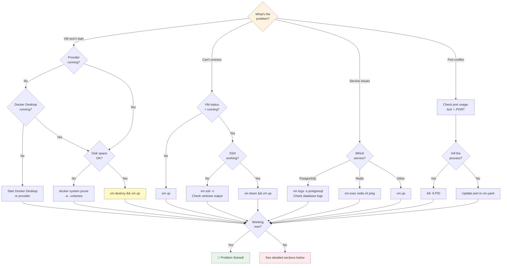

# Troubleshooting

Fix common VM issues quickly with our diagnostic flowchart.

## Diagnostic Guide



:::danger Universal Fix
90% of issues are solved by resetting your environment. Try this first:
```bash
vm destroy && vm up
```
Your database backups are created automatically, so your data is safe!
:::

## Quick Fixes

### VM Won't Start
```bash
# Try the universal fix first
vm destroy && vm up

# Check if services are running
docker ps -a  # For Docker provider

# Check available resources
docker system df  # Disk space
docker system prune  # Clean up
```

### Can't Connect to VM
```bash
# Check VM status
vm status

# Try restarting
vm down && vm up

# Check SSH configuration
vm ssh -v  # Verbose SSH output
```

### Port Conflicts
```bash
# Find what's using the port
lsof -i :3000  # Replace 3000 with your port
netstat -tulpn | grep :3000

# Update your configuration
# Edit vm.yaml and change conflicting ports
vm destroy && vm up
```

## Docker Issues

### Docker Permission Denied
```bash
# Add user to docker group (Linux)
sudo usermod -aG docker $USER
newgrp docker

# Restart Docker service
sudo systemctl restart docker

# Verify access
docker ps
```

### Docker Desktop Not Running (macOS/Windows)
1. Start Docker Desktop application
2. Wait for Docker to fully initialize
3. Check system tray for Docker icon
4. Try `docker ps` to verify

### Container Resource Issues
```bash
# Check Docker resources
docker system df
docker container ls -a

# Clean up unused containers
docker container prune
docker image prune
docker volume prune

# Increase Docker resources in Docker Desktop settings
# Memory: 4GB+ recommended
# CPUs: 2+ recommended
```

### Container Won't Start
```bash
# Check container logs. Get container name from `vm status`.
docker logs <container_name>

# Check for port conflicts
docker port <container_name>

# Restart with fresh container
vm destroy && vm up
```

## Tart Issues (Apple Silicon)

### Tart Not Found
```bash
# Install Tart
brew install cirruslabs/cli/tart

# Verify installation
tart --version
which tart
```

### VM Boot Failures
```bash
# Check available disk space (Tart needs significant space)
df -h

# List available images
tart list

# Pull fresh image
tart pull ghcr.io/cirruslabs/macos-sonoma-base:latest
```

### SSH Connection Problems
```bash
# Check if SSH is enabled in VM
tart run <vm-name> -- systemctl status ssh

# Verify SSH key setup
cat ~/.ssh/id_rsa.pub
```

## Configuration Issues

### Invalid Configuration
```bash
# Validate your configuration
vm validate

# Check for syntax errors
yaml-lint vm.yaml  # If you have yamllint installed

# Use minimal config to test
echo "os: ubuntu" > vm.yaml
vm up
```

### Preset Problems
```bash
# Apply the vibe preset for full-featured development
vm config preset vibe

# Apply minimal base preset
vm config preset base

# Check available presets
vm config preset --list
```

### Service Configuration Issues
```bash
# Test individual services
docker run -d --name test-postgres postgres:13
docker logs test-postgres

# Check service dependencies
vm exec "systemctl status postgresql"
vm exec "systemctl status redis"

# Restart services
vm up  # Re-run applying scripts
```

## Database Issues

### PostgreSQL Won't Start
```bash
# Check PostgreSQL status
vm exec "systemctl status postgresql"

# Check PostgreSQL logs
vm exec "tail -f /var/log/postgresql/postgresql-*.log"

# Reset PostgreSQL data
vm exec "sudo rm -rf /var/lib/postgresql/*/main && sudo -u postgres initdb -D /var/lib/postgresql/*/main"
```

### Redis Connection Refused
```bash
# Check Redis status
vm exec "systemctl status redis"

# Test Redis connection
vm exec "redis-cli ping"

# Check Redis configuration
vm exec "cat /etc/redis/redis.conf | grep bind"
```

### Database Data Lost
```bash
# Database data is ephemeral by default and lost on VM destruction
# Use database backups for data recovery

# Check if backup files exist
ls -la *backup*.sql.gz

# Configure auto-restore in vm.yaml
project:
  backup_pattern: "*backup*.sql.gz"

# Recreate VM (backups auto-restore)
vm destroy && vm up
```

## Network Issues

### Can't Access Services from Host
```bash
# Check port forwarding
vm status  # Shows port mappings

# Verify service is listening
vm exec "netstat -tulpn | grep :3000"

# Check firewall settings
vm exec "sudo ufw status"

# Test direct connection
curl http://localhost:3000
```

### Services Not Accessible from Network
```yaml
# Update vm.yaml for network access
vm:
  port_binding: "0.0.0.0"  # Instead of 127.0.0.1

# Recreate VM
vm destroy && vm up
```

### DNS Resolution Issues
```bash
# Check /etc/hosts
vm exec "cat /etc/hosts"

# Test DNS resolution
vm exec "nslookup google.com"
vm exec "dig google.com"

# Update DNS servers
vm exec "echo 'nameserver 8.8.8.8' >> /etc/resolv.conf"
```

## File Sync Issues

### Files Not Syncing
```bash
# Check mount points
vm exec "mount | grep workspace"
df -h  # Check for mount issues

# Restart file sync (Docker). Get container name from `vm status`.
docker restart <container_name>

```

### Permission Errors
```bash
# Check file permissions
ls -la ./

# Fix ownership in VM
vm exec "sudo chown -R \$USER:\$USER /workspace"

# Check mount options
vm exec "mount | grep workspace"
```

### Slow File Operations
```bash
# For Docker on macOS, use cached mounts
# Add to vm.yaml:
mounts:
  - "./:/workspace:cached"

```

## Debugging Mode

### Enable Debug Output
```bash
# Verbose VM tool output
LOG_LEVEL=DEBUG vm up

# Shell script debugging
VM_DEBUG=true vm up

# Docker/Podman verbose output
VM_VERBOSE=true vm up
```

### VM Tool Path Configuration
```bash
# Set custom VM tool installation directory
export VM_TOOL_DIR=/path/to/vm/installation
vm up

# Check current VM tool directory detection
VM_TOOL_DIR=/custom/path vm up  # Will use custom path
vm up  # Will auto-detect from binary location

# Troubleshoot vm-tool mount issues in Docker
export VM_TOOL_DIR=/Users/username/projects/vm
vm destroy && vm up
```

**VM_TOOL_DIR Environment Variable:**
- **Purpose**: Specifies the VM tool installation directory for container mounting
- **Auto-detection**: Usually detected automatically from binary location
- **When to set**: When binary is installed in non-standard location or via symlink
- **Docker usage**: Mounts this directory to `/vm-tool` in containers for Ansible access

### Inspect VM State
```bash
# Get detailed VM information
vm status --verbose

# Access VM directly. Get container name from `vm status`.
docker exec -it <container_name> /bin/bash  # Docker

# Check running processes
vm exec "ps aux"
vm exec "systemctl status"
```

### Log Analysis
```bash
# View VM tool logs
vm logs

# View system logs in VM
vm exec "journalctl -f"
vm exec "tail -f /var/log/syslog"

# View service-specific logs
vm exec "docker logs redis"  # If using Docker services
```

## Getting Help

### System Information
```bash
# Gather system info for support
echo "=== System Info ==="
uname -a
docker --version
tart --version 2>/dev/null || echo "Tart not installed"

echo "=== VM Status ==="
vm status

echo "=== Configuration ==="
cat vm.yaml
```

### Reset Everything
```bash
# Nuclear option - reset everything
vm destroy
docker system prune -a  # Docker cleanup
rm -rf .vm/  # Remove local VM data
vm up  # Start fresh
```

### Report Issues
When reporting issues, include:
1. Operating system and version
2. Provider being used (Docker/Podman/Tart)
3. VM configuration (vm.yaml)
4. Error messages and logs
5. Steps to reproduce

## Advanced Debugging

For power users and contributors debugging complex issues.

### Debug Mode

Enable verbose logging to see internal operations:

```bash
# Verbose output for single command
vm --verbose create
vm -v status

# Persistent debug logging
export VM_DEBUG=1
vm up
vm status

# Rust logging (for developers)
export RUST_LOG=debug
vm up
```

**Log levels:**
- `error` - Only errors
- `warn` - Warnings and errors
- `info` - General information (default)
- `debug` - Detailed debugging
- `trace` - Very verbose tracing

### Service Health Checks

Diagnose service connectivity issues:

```bash
# Inside VM - check service health
vm ssh

# PostgreSQL
pg_isready -h localhost -p 5432
psql -h localhost -U postgres -c "SELECT version();"

# Redis
redis-cli ping
redis-cli info

# MongoDB
mongosh --eval "db.adminCommand('ping')"

# MySQL
mysqladmin ping -h localhost

# Check ports actually listening
netstat -tulpn | grep LISTEN
ss -tulpn | grep LISTEN
```

### Plugin Debugging

Validate and debug custom plugins:

```bash
# Validate plugin structure
vm plugin validate my-plugin

# Check plugin manifest
cat ~/.vm/plugins/my-plugin/plugin.yaml

# Test plugin in isolation
vm config preset my-plugin --dry-run

# Plugin logs
ls -la ~/.vm/plugins/
cat ~/.vm/logs/plugins/my-plugin.log
```

### Snapshot Verification

Debug snapshot issues:

```bash
# List snapshots with details
vm snapshot list --verbose

# Verify snapshot integrity
vm snapshot export my-snapshot --verify

# Check snapshot contents
tar -tzf my-snapshot.snapshot.tar.gz | head -20

# Import with verification
vm snapshot import backup.tar.gz --verify
```

### Performance Profiling

Identify bottlenecks:

```bash
# Time VM creation
time vm up

# Profile docker operations
docker stats

# Check disk I/O
iostat -x 1 5  # Linux
sudo fs_usage | grep docker  # macOS

# Memory usage
docker system df
free -h  # Linux
vm_stat  # macOS

# Network debugging
vm ssh
tcpdump -i any port 5432  # Monitor PostgreSQL traffic
```

### Collect Debug Information

Gather comprehensive debug info for bug reports:

```bash
# System information
vm doctor > debug-info.txt

# Configuration
cat vm.yaml >> debug-info.txt
cat ~/.vm/config.yaml >> debug-info.txt

# Logs
vm logs -n 100 >> debug-info.txt
docker logs $(docker ps -q --filter ancestor=ubuntu) >> debug-info.txt

# Provider status
docker ps -a >> debug-info.txt
docker version >> debug-info.txt

# Network configuration
docker network ls >> debug-info.txt
docker network inspect bridge >> debug-info.txt
```

### Common Advanced Issues

**Plugin not loading:**
```bash
# Check plugin directory permissions
ls -la ~/.vm/plugins/my-plugin

# Validate YAML syntax
vm plugin validate my-plugin

# Check for naming conflicts
vm plugin list | grep my-plugin
```

**Service port conflicts:**
```bash
# Find process using port
lsof -i :5432
netstat -tulpn | grep 5432

# Check Docker port bindings
docker port $(docker ps -q --filter name=my-project)
```

**Snapshot corruption:**
```bash
# Verify archive integrity
tar -tzf snapshot.tar.gz > /dev/null

# Check file permissions
ls -lh snapshot.tar.gz

# Re-export with higher compression
vm snapshot export my-snap --compress 1  # Faster, less compression
```

**Memory issues:**
```bash
# Check container resource limits
docker stats --no-stream

# Inspect actual memory usage
docker exec my-project free -h

# Adjust limits in vm.yaml
vm:
  memory: "8gb"  # Increase if hitting OOM
  swap: "4gb"
```

## Performance Tips

### Speed Up VM Creation
```bash
# Pre-pull base images
docker pull ubuntu:22.04

# Use minimal configurations for testing
echo "os: alpine" > test.yaml
vm --config test.yaml create
```

### Optimize Resource Usage
```yaml
# Minimal resources for simple projects
vm:
  memory: 2048  # Also: "2gb", "50%", "unlimited"
  cpus: 1       # Also: "50%", "unlimited"

# More resources for complex projects
vm:
  memory: 8192  # Also: "8gb", "75%", "unlimited"
  cpus: 4       # Also: "75%", "unlimited"
```

### Reduce Startup Time
```bash
# Disable unnecessary services
services:
  postgresql:
    enabled: false
  redis:
    enabled: false

# Use lighter OS options
os: alpine  # Smallest
os: debian  # Lightweight
os: ubuntu  # Full-featured
```